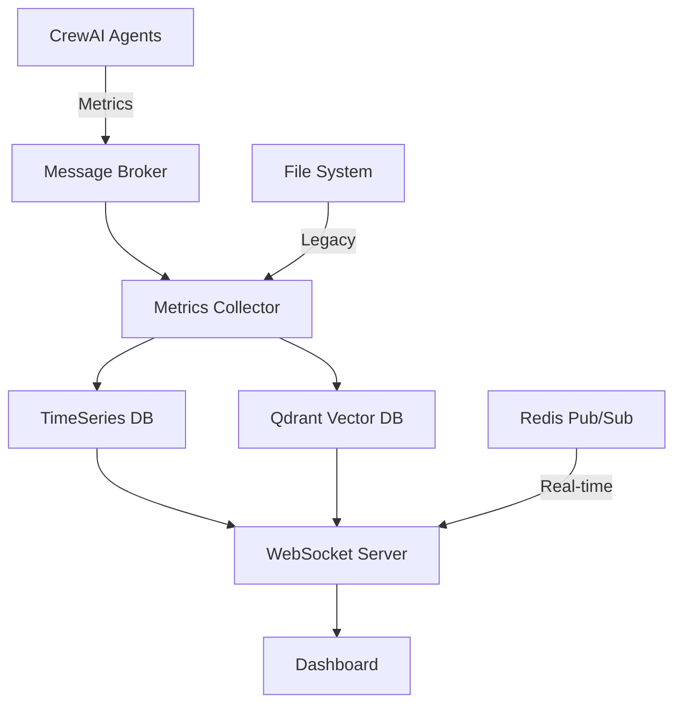

# CrewAI Dashboard Integration Guide

## 📋 Übersicht

Diese Dokumentation beschreibt die Integration des Multi-Agent Dashboards mit CrewAI für Echtzeit-Monitoring und Metriken-Erfassung.

## 🏗️ Architektur-Übersicht



## 📊 Datenerfassung durch Agenten

### 1. System Monitor Agent
**Rolle**: Überwacht System-Level Metriken

```python
from crewai import Agent, Task
from datetime import datetime
import psutil
import json

class SystemMonitorAgent(Agent):
    def __init__(self):
        super().__init__(
            role='System Monitor',
            goal='Collect system-level metrics for all agents',
            backstory='I monitor the health and performance of our multi-agent system',
            verbose=True
        )
        self.metrics_buffer = []
    
    def collect_metrics(self):
        """Sammelt System-Metriken alle 100ms"""
        metrics = {
            'timestamp': datetime.now().isoformat(),
            'agent_id': 'system_monitor',
            'type': 'system',
            'data': {
                'cpu_usage': psutil.cpu_percent(),
                'memory_usage': psutil.virtual_memory().percent,
                'active_agents': self.count_active_agents(),
                'message_queue_size': self.get_queue_size()
            }
        }
        return metrics
    
    def publish_metrics(self, metrics):
        """Publiziert Metriken an Message Broker"""
        # Option 1: Redis Pub/Sub
        redis_client.publish('metrics:system', json.dumps(metrics))
        
        # Option 2: Qdrant Vector Store
        self.store_in_qdrant(metrics)
```

### 2. Task Coordinator Agent
**Rolle**: Verfolgt Task-Completion und Koordination

```python
class TaskCoordinatorAgent(Agent):
    def __init__(self):
        super().__init__(
            role='Task Coordinator',
            goal='Track task distribution and completion rates',
            backstory='I coordinate tasks between agents and monitor their progress'
        )
        self.task_metrics = {
            'total_tasks': 0,
            'completed_tasks': 0,
            'failed_tasks': 0,
            'in_progress': 0
        }
    
    def on_task_assigned(self, task, agent):
        """Wird aufgerufen wenn Task zugewiesen wird"""
        metrics = {
            'timestamp': datetime.now().isoformat(),
            'event': 'task_assigned',
            'task_id': task.id,
            'agent_id': agent.id,
            'estimated_duration': task.estimated_duration
        }
        self.publish_event(metrics)
    
    def on_task_completed(self, task, result):
        """Wird aufgerufen wenn Task abgeschlossen ist"""
        self.task_metrics['completed_tasks'] += 1
        
        # Berechne TCR (Task Completion Rate)
        tcr = (self.task_metrics['completed_tasks'] / 
               self.task_metrics['total_tasks']) * 100
        
        metrics = {
            'timestamp': datetime.now().isoformat(),
            'event': 'task_completed',
            'task_id': task.id,
            'duration': task.actual_duration,
            'tcr': tcr,
            'velocity': self.calculate_velocity()
        }
        self.publish_event(metrics)
```

### 3. Communication Monitor Agent
**Rolle**: Überwacht Inter-Agent Kommunikation

```python
class CommunicationMonitorAgent(Agent):
    def __init__(self):
        super().__init__(
            role='Communication Monitor',
            goal='Monitor inter-agent communication patterns',
            backstory='I analyze communication efficiency and patterns'
        )
        self.message_counts = {}
        self.latency_buffer = []
    
    def intercept_message(self, sender, receiver, message):
        """Interceptor für alle Agent-zu-Agent Nachrichten"""
        start_time = datetime.now()
        
        # Message tracking
        key = f"{sender.id}->{receiver.id}"
        self.message_counts[key] = self.message_counts.get(key, 0) + 1
        
        # Latency measurement
        def on_response(response):
            latency = (datetime.now() - start_time).total_seconds() * 1000
            self.latency_buffer.append(latency)
            
            metrics = {
                'timestamp': start_time.isoformat(),
                'sender': sender.id,
                'receiver': receiver.id,
                'message_type': message.type,
                'latency_ms': latency,
                'throughput': self.calculate_throughput()
            }
            self.publish_metrics(metrics)
        
        return on_response
```

### 4. Intelligence Analyzer Agent
**Rolle**: Bewertet Collective Intelligence und Emergenz

```python
class IntelligenceAnalyzerAgent(Agent):
    def __init__(self):
        super().__init__(
            role='Intelligence Analyzer',
            goal='Measure collective intelligence and emergent behaviors',
            backstory='I analyze how well agents work together'
        )
    
    def analyze_coordination(self, crew_results):
        """Analysiert Koordinations-Score nach Task-Batch"""
        individual_performance = sum(r.individual_score for r in crew_results)
        collective_performance = crew_results.collective_score
        
        # Collective Intelligence Coefficient
        ci_coefficient = collective_performance / individual_performance
        
        # Coordination Score (1-5 Skala)
        coordination_score = self.calculate_coordination_score(crew_results)
        
        metrics = {
            'timestamp': datetime.now().isoformat(),
            'type': 'intelligence',
            'ci_coefficient': ci_coefficient,
            'coordination_score': coordination_score,
            'synergy_detected': ci_coefficient > 1.0,
            'emergence_patterns': self.detect_patterns(crew_results)
        }
        
        return metrics
```

## 🔄 Datenfluss-Prozess

### Aktueller Ansatz (File-basiert) ❌
```python
# NICHT EMPFOHLEN - Aktueller file-basierter Ansatz
def save_metrics_to_file(metrics):
    with open('metrics.json', 'a') as f:
        f.write(json.dumps(metrics) + '\n')

# Probleme:
# - Keine Echtzeit-Updates
# - File-Locking Issues
# - Schwer zu skalieren
# - Keine Querying-Möglichkeiten
```

### Empfohlener Ansatz 1: Redis Pub/Sub + TimeSeries ✅

```python
import redis
from redis.commands.timeseries import TimeSeries

class MetricsPublisher:
    def __init__(self):
        self.redis = redis.Redis(host='localhost', port=6379, decode_responses=True)
        self.ts = self.redis.ts()
        
        # Create TimeSeries keys
        self.ts.create('tcr', labels={'metric': 'task_completion_rate'})
        self.ts.create('velocity', labels={'metric': 'system_velocity'})
        self.ts.create('throughput', labels={'metric': 'message_throughput'})
    
    def publish_metric(self, metric_name, value, timestamp=None):
        """Publiziert Metrik an Redis TimeSeries und Pub/Sub"""
        ts = timestamp or int(datetime.now().timestamp() * 1000)
        
        # Store in TimeSeries
        self.ts.add(metric_name, ts, value)
        
        # Publish to channel for real-time updates
        self.redis.publish(f'metrics:{metric_name}', json.dumps({
            'timestamp': ts,
            'value': value,
            'metric': metric_name
        }))
    
    def get_metrics_range(self, metric_name, from_time, to_time):
        """Holt historische Metriken"""
        return self.ts.range(metric_name, from_time, to_time)
```

### Empfohlener Ansatz 2: Qdrant für Complex Event Storage ✅

```python
from qdrant_client import QdrantClient
from qdrant_client.models import Distance, VectorParams, PointStruct
import numpy as np

class QdrantMetricsStore:
    def __init__(self):
        self.client = QdrantClient("localhost", port=6333)
        
        # Create collections
        self.setup_collections()
    
    def setup_collections(self):
        """Erstellt spezialisierte Collections für verschiedene Metriken"""
        
        # Collection für Agent-States
        self.client.create_collection(
            collection_name="agent_states",
            vectors_config=VectorParams(size=128, distance=Distance.COSINE)
        )
        
        # Collection für Task-Patterns
        self.client.create_collection(
            collection_name="task_patterns",
            vectors_config=VectorParams(size=256, distance=Distance.EUCLID)
        )
        
        # Collection für Communication-Networks
        self.client.create_collection(
            collection_name="communication_graphs",
            vectors_config=VectorParams(size=512, distance=Distance.DOT)
        )
    
    def store_agent_state(self, agent_id, state_data):
        """Speichert Agent-State mit Embedding"""
        # Generate embedding from state
        embedding = self.generate_state_embedding(state_data)
        
        point = PointStruct(
            id=f"{agent_id}_{datetime.now().timestamp()}",
            vector=embedding,
            payload={
                "agent_id": agent_id,
                "timestamp": datetime.now().isoformat(),
                "state": state_data,
                "metrics": {
                    "cpu": state_data.get('cpu_usage'),
                    "memory": state_data.get('memory_usage'),
                    "tasks_completed": state_data.get('tasks_completed')
                }
            }
        )
        
        self.client.upsert(
            collection_name="agent_states",
            points=[point]
        )
    
    def find_similar_states(self, current_state, limit=10):
        """Findet ähnliche historische Zustände für Anomalie-Erkennung"""
        embedding = self.generate_state_embedding(current_state)
        
        results = self.client.search(
            collection_name="agent_states",
            query_vector=embedding,
            limit=limit
        )
        
        return results
    
    def generate_state_embedding(self, state_data):
        """Generiert Embedding aus State-Daten"""
        # Simplified example - in production use proper encoder
        features = [
            state_data.get('cpu_usage', 0),
            state_data.get('memory_usage', 0),
            state_data.get('task_count', 0),
            state_data.get('message_rate', 0),
            # ... more features
        ]
        
        # Normalize and pad to embedding size
        embedding = np.array(features)
        embedding = np.pad(embedding, (0, 128 - len(features)), 'constant')
        return embedding.tolist()
```

## 🚀 Hybrid-Architektur (Empfohlen)

```python
from dataclasses import dataclass
from typing import Dict, Any
import asyncio
from aiokafka import AIOKafkaProducer, AIOKafkaConsumer

@dataclass
class MetricsConfig:
    redis_host: str = 'localhost'
    redis_port: int = 6379
    qdrant_host: str = 'localhost'
    qdrant_port: int = 6333
    kafka_broker: str = 'localhost:9092'

class HybridMetricsSystem:
    """
    Kombiniert mehrere Speicher-Backends für optimale Performance:
    - Redis: Real-time metrics & pub/sub
    - Qdrant: Complex event storage & similarity search
    - Kafka: Event streaming & replay
    - PostgreSQL: Long-term storage & reporting
    """
    
    def __init__(self, config: MetricsConfig):
        self.config = config
        self.setup_connections()
    
    def setup_connections(self):
        # Redis für Real-time
        self.redis = redis.Redis(
            host=self.config.redis_host,
            port=self.config.redis_port
        )
        
        # Qdrant für Vector Search
        self.qdrant = QdrantClient(
            host=self.config.qdrant_host,
            port=self.config.qdrant_port
        )
        
        # Kafka für Event Streaming
        self.kafka_producer = AIOKafkaProducer(
            bootstrap_servers=self.config.kafka_broker
        )
    
    async def process_metric(self, metric: Dict[str, Any]):
        """Verarbeitet Metrik durch alle Systeme"""
        
        # 1. Real-time broadcast via Redis
        await self.broadcast_realtime(metric)
        
        # 2. Store in TimeSeries for graphs
        await self.store_timeseries(metric)
        
        # 3. Vector storage for pattern analysis
        await self.store_vector(metric)
        
        # 4. Event stream for replay/audit
        await self.stream_event(metric)
    
    async def broadcast_realtime(self, metric):
        """Redis Pub/Sub für WebSocket Updates"""
        channel = f"metrics:{metric['type']}"
        self.redis.publish(channel, json.dumps(metric))
    
    async def store_timeseries(self, metric):
        """Redis TimeSeries für Graphen"""
        if metric['type'] == 'system':
            self.redis.ts().add('tcr', '*', metric['data']['tcr'])
            self.redis.ts().add('velocity', '*', metric['data']['velocity'])
    
    async def store_vector(self, metric):
        """Qdrant für Pattern Recognition"""
        if metric['type'] == 'agent_state':
            embedding = self.generate_embedding(metric['data'])
            self.qdrant.upsert(
                collection_name="agent_states",
                points=[{
                    'id': metric['agent_id'],
                    'vector': embedding,
                    'payload': metric
                }]
            )
    
    async def stream_event(self, metric):
        """Kafka für Event Sourcing"""
        await self.kafka_producer.send(
            'agent-metrics',
            value=json.dumps(metric).encode()
        )
```

## 🔌 WebSocket Server für Dashboard

```python
from fastapi import FastAPI, WebSocket
from fastapi.middleware.cors import CORSMiddleware
import asyncio
import json

app = FastAPI()

# CORS für Dashboard
app.add_middleware(
    CORSMiddleware,
    allow_origins=["http://localhost:8080"],
    allow_methods=["*"],
    allow_headers=["*"],
)

class MetricsWebSocketManager:
    def __init__(self):
        self.active_connections: List[WebSocket] = []
        self.redis_client = redis.Redis(decode_responses=True)
        self.pubsub = self.redis_client.pubsub()
    
    async def connect(self, websocket: WebSocket):
        await websocket.accept()
        self.active_connections.append(websocket)
        
        # Subscribe to all metric channels
        self.pubsub.subscribe('metrics:*')
        
        # Start listening for updates
        asyncio.create_task(self.redis_listener(websocket))
    
    async def redis_listener(self, websocket: WebSocket):
        """Hört auf Redis Pub/Sub und sendet an WebSocket"""
        try:
            while True:
                message = self.pubsub.get_message()
                if message and message['type'] == 'message':
                    await websocket.send_text(message['data'])
                await asyncio.sleep(0.01)
        except Exception as e:
            print(f"WebSocket error: {e}")
            self.disconnect(websocket)
    
    def disconnect(self, websocket: WebSocket):
        self.active_connections.remove(websocket)

manager = MetricsWebSocketManager()

@app.websocket("/ws/metrics")
async def websocket_endpoint(websocket: WebSocket):
    await manager.connect(websocket)
    try:
        while True:
            # Keep connection alive
            await websocket.receive_text()
    except:
        manager.disconnect(websocket)

@app.get("/api/metrics/history")
async def get_metrics_history(metric: str, from_time: int, to_time: int):
    """REST API für historische Daten"""
    redis_client = redis.Redis(decode_responses=True)
    data = redis_client.ts().range(metric, from_time, to_time)
    return {"metric": metric, "data": data}
```

## 📦 CrewAI Integration

```python
from crewai import Crew, Agent, Task
from typing import List

class MonitoredCrew(Crew):
    """Extended Crew class mit Monitoring-Capabilities"""
    
    def __init__(self, agents: List[Agent], tasks: List[Task]):
        super().__init__(agents, tasks)
        
        # Add monitoring agents
        self.system_monitor = SystemMonitorAgent()
        self.task_coordinator = TaskCoordinatorAgent()
        self.comm_monitor = CommunicationMonitorAgent()
        self.intelligence_analyzer = IntelligenceAnalyzerAgent()
        
        # Metrics system
        self.metrics_system = HybridMetricsSystem(MetricsConfig())
        
        # Hook into crew lifecycle
        self.setup_hooks()
    
    def setup_hooks(self):
        """Installiert Monitoring-Hooks"""
        
        # Before task execution
        self.before_task_execution = self.on_task_start
        
        # After task execution  
        self.after_task_execution = self.on_task_complete
        
        # Message interception
        self.message_interceptor = self.comm_monitor.intercept_message
    
    async def on_task_start(self, task, agent):
        """Wird vor Task-Ausführung aufgerufen"""
        metrics = {
            'timestamp': datetime.now().isoformat(),
            'type': 'task_start',
            'task_id': task.id,
            'agent_id': agent.id,
            'task_type': task.__class__.__name__
        }
        await self.metrics_system.process_metric(metrics)
    
    async def on_task_complete(self, task, agent, result):
        """Wird nach Task-Completion aufgerufen"""
        metrics = {
            'timestamp': datetime.now().isoformat(),
            'type': 'task_complete',
            'task_id': task.id,
            'agent_id': agent.id,
            'success': result.success,
            'duration_ms': result.duration
        }
        await self.metrics_system.process_metric(metrics)
        
        # Update TCR
        self.task_coordinator.on_task_completed(task, result)
    
    async def kickoff(self):
        """Startet Crew mit Monitoring"""
        
        # Start monitoring agents
        asyncio.create_task(self.run_monitors())
        
        # Run normal crew execution
        result = await super().kickoff()
        
        # Analyze collective performance
        intelligence_metrics = self.intelligence_analyzer.analyze_coordination(result)
        await self.metrics_system.process_metric(intelligence_metrics)
        
        return result
    
    async def run_monitors(self):
        """Background task für kontinuierliches Monitoring"""
        while True:
            # Collect system metrics
            system_metrics = self.system_monitor.collect_metrics()
            await self.metrics_system.process_metric(system_metrics)
            
            # Wait 100ms
            await asyncio.sleep(0.1)
```

## 🚀 Deployment

### Docker Compose Setup

```yaml
version: '3.8'

services:
  redis:
    image: redis/redis-stack:latest
    ports:
      - "6379:6379"
    volumes:
      - redis_data:/data
  
  qdrant:
    image: qdrant/qdrant
    ports:
      - "6333:6333"
    volumes:
      - qdrant_data:/qdrant/storage
  
  kafka:
    image: confluentinc/cp-kafka:latest
    ports:
      - "9092:9092"
    environment:
      KAFKA_ZOOKEEPER_CONNECT: zookeeper:2181
      KAFKA_ADVERTISED_LISTENERS: PLAINTEXT://localhost:9092
  
  zookeeper:
    image: confluentinc/cp-zookeeper:latest
    ports:
      - "2181:2181"
    environment:
      ZOOKEEPER_CLIENT_PORT: 2181
  
  metrics-server:
    build: ./metrics-server
    ports:
      - "8000:8000"
    depends_on:
      - redis
      - qdrant
      - kafka
    environment:
      REDIS_HOST: redis
      QDRANT_HOST: qdrant
      KAFKA_BROKER: kafka:9092
  
  dashboard:
    image: nginx:alpine
    ports:
      - "8080:80"
    volumes:
      - ./dashboard:/usr/share/nginx/html

volumes:
  redis_data:
  qdrant_data:
```

## 📊 Dashboard JavaScript Integration

```javascript
// dashboard/js/websocket-client.js

class MetricsWebSocketClient {
    constructor(url = 'ws://localhost:8000/ws/metrics') {
        this.url = url;
        this.ws = null;
        this.reconnectInterval = 5000;
        this.connect();
    }
    
    connect() {
        this.ws = new WebSocket(this.url);
        
        this.ws.onopen = () => {
            console.log('Connected to metrics server');
            this.onConnect();
        };
        
        this.ws.onmessage = (event) => {
            const metrics = JSON.parse(event.data);
            this.handleMetrics(metrics);
        };
        
        this.ws.onerror = (error) => {
            console.error('WebSocket error:', error);
        };
        
        this.ws.onclose = () => {
            console.log('WebSocket closed, reconnecting...');
            setTimeout(() => this.connect(), this.reconnectInterval);
        };
    }
    
    handleMetrics(metrics) {
        switch(metrics.type) {
            case 'system':
                updateSystemMetrics(metrics.data);
                break;
            case 'task_complete':
                updateTaskMetrics(metrics);
                break;
            case 'intelligence':
                updateIntelligenceMetrics(metrics);
                break;
            case 'communication':
                updateCommunicationGraph(metrics);
                break;
        }
    }
    
    onConnect() {
        // Request initial state
        this.ws.send(JSON.stringify({
            type: 'request_state',
            metrics: ['tcr', 'velocity', 'throughput', 'agents']
        }));
    }
}

// Initialize on page load
document.addEventListener('DOMContentLoaded', () => {
    const client = new MetricsWebSocketClient();
});
```

## 🎯 Metriken-Sammlung Timeline

| Zeitpunkt | Agent | Metrik | Frequenz |
|-----------|-------|--------|----------|
| Kontinuierlich | System Monitor | CPU, Memory, Active Agents | 100ms |
| Task Start | Task Coordinator | Task Assignment | Event-based |
| Task End | Task Coordinator | TCR, Velocity | Event-based |
| Message Send | Comm Monitor | Throughput, Latency | Event-based |
| Batch Complete | Intelligence Analyzer | CI Coefficient, Coordination | Nach jedem Batch |
| Anomalie | All Agents | Alerts, Errors | Sofort |

## 🔧 Vorteile der Hybrid-Lösung

### ✅ Vorteile gegenüber File-basiert:
1. **Echtzeit-Updates** - Keine Polling-Delays
2. **Skalierbarkeit** - Horizontal skalierbar
3. **Query-Performance** - Optimierte Zeitreihen-Queries
4. **Pattern Recognition** - Vector-Search in Qdrant
5. **Event Replay** - Kafka Event Sourcing
6. **Multi-Client** - Mehrere Dashboards möglich

### 📊 Speicher-Strategie:
- **Redis**: Last 24h (Real-time)
- **Qdrant**: Last 7 days (Patterns)
- **Kafka**: Last 30 days (Events)
- **PostgreSQL**: Permanent (Reporting)

## 🚦 Nächste Schritte

1. **Setup Infrastructure**:
   ```bash
   docker-compose up -d
   ```

2. **Install Python Dependencies**:
   ```bash
   pip install crewai redis qdrant-client aiokafka fastapi uvicorn
   ```

3. **Start Metrics Server**:
   ```bash
   uvicorn metrics_server:app --reload --port 8000
   ```

4. **Configure CrewAI**:
   ```python
   crew = MonitoredCrew(agents=my_agents, tasks=my_tasks)
   await crew.kickoff()
   ```

5. **Open Dashboard**:
   ```
   http://localhost:8080
   ```

---

Diese Architektur bietet maximale Flexibilität und Performance für Multi-Agent System Monitoring in Produktion.
